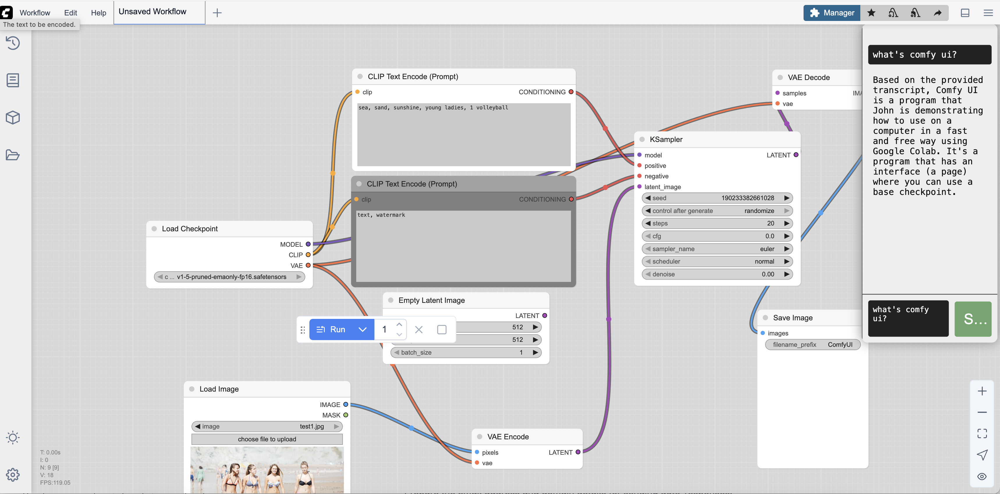

# Comfy UI Tutorial Agent

## Overview
The Comfy UI Tutorial Agent is a sidebar/chatbot interface integrated into the Comfy UI, an open-source user interface for running the Stable Diffusion model locally. The agent assists users by providing instructions, answering questions, and linking to relevant resources such as YouTube videos. The long-term goal is for the agent to create Comfy UI elements based on user requirements.

## Objectives and Goals
- Enhance user experience by providing an interactive help system within Comfy UI.
- Reduce the learning curve for new users by offering step-by-step instructions and resources.
- Increase user engagement and satisfaction by providing quick and accurate responses to user queries.

## Architecture and Components
- **Frontend**: Built using React.js and integrated into the right sidebar of Comfy UI.
- **Backend**: Implemented using Python, handling user queries, processing them using Google Gemini for NLP, and fetching relevant information from various data sources, including Pinecone (vector database).
- **NLP Service**: Google Gemini for understanding user queries and generating appropriate responses.
- **YouTube Integration**: Backend integrates with YouTube's API to fetch video links and timestamps, and stores transcripts and screenshots in a vector database.
- **Vector Database**: Used to store and retrieve information extracted from YouTube videos and other data sources.
- **WebSocket Communication**: Facilitates real-time, bidirectional communication between the frontend and backend.
