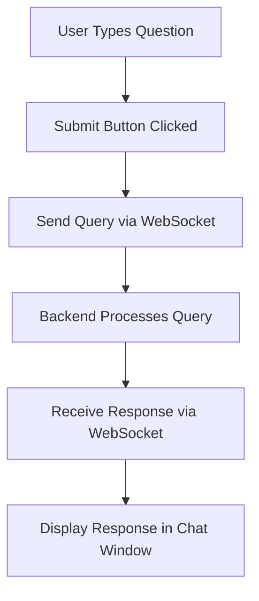

# Frontend Design Document for Comfy UI Tutorial Agent

## Overview
The frontend of the Comfy UI Tutorial Agent is designed to provide an interactive chatbot interface, similar to ChatGPT, integrated into the right sidebar of the Comfy UI. The interface allows users to type their questions and receive responses in real-time.

## User Interface Design

### Layout
- The chatbot interface will be positioned at the very right side of the UI page.
- The interface will include an input box at the bottom of the UI component for users to type their questions.
- A submit button will be provided next to the input box for users to submit their queries.

### Components
1. **Chat Window**: Displays the conversation between the user and the chatbot.
2. **Input Box**: Allows users to type their questions.
3. **Submit Button**: Allows users to submit their questions to the chatbot.

### User Interaction Flow
1. **User Types a Question**: The user types their question into the input box at the bottom of the chatbot interface.
2. **Submit Question**: The user clicks the submit button to send their question to the backend.
3. **Receive Response**: The chatbot processes the question and displays the response in the chat window.

## Technical Specifications

### Technology Stack
- **Frontend Framework**: React.js
- **Styling**: CSS for styling the chatbot interface to match the overall look of Comfy UI.
- **WebSocket**: Used for real-time communication between the frontend and backend.

### Component Structure
- **Chatbot Component**: The main component that includes the chat window, input box, and submit button.
- **ChatWindow Component**: A sub-component that displays the conversation history.
- **InputBox Component**: A sub-component that includes the input field and submit button.

### State Management
- **State Management**: Use React's state management to handle the state of the conversation, input box, and responses.

### WebSocket Integration
- **WebSocket Connection**: Establish a WebSocket connection to the backend when the chatbot component is mounted.
- **Send Message**: Send the user's question to the backend via WebSocket when the submit button is clicked.
- **Receive Message**: Listen for responses from the backend and update the chat window with the received message.

## User Interface and Experience
- The chatbot interface will have a clean and minimalistic design to match the overall look of Comfy UI.
- The input box and submit button will be easily accessible at the bottom of the interface.
- The chat window will display the conversation in a clear and organized manner.

### UI Flow Diagram

## Accessibility Considerations
- Ensure that the input box and submit button are accessible via keyboard navigation.
- Provide appropriate ARIA labels for screen readers.

## Testing and Quality Assurance
- **Unit Tests**: Write unit tests for each component to ensure they function correctly.
- **Integration Tests**: Write integration tests to ensure the components work together as expected.
- **User Testing**: Conduct user testing to gather feedback on the usability and accessibility of the chatbot interface.

## Milestones
1. **Design Phase**: Complete UI/UX design and finalize technical specifications.
2. **Development Phase**: Implement the chatbot interface and integrate it with the backend.
3. **Testing Phase**: Conduct thorough testing to ensure functionality and performance.
4. **Launch Phase**: Deploy the chatbot to the production environment.

## Risks and Mitigations
- **User Adoption**: Users may be hesitant to use the new chatbot interface. Mitigation: Provide clear documentation and tutorials on how to use the chatbot.
- **Technical Issues**: Potential issues with WebSocket communication. Mitigation: Implement robust error handling and fallback mechanisms.

## Acceptance Criteria
- The chatbot interface must be fully integrated into the right sidebar of Comfy UI.
- Users must be able to type questions and receive accurate responses in real-time.
- The interface must be intuitive and easy to use.
- The system must handle at least 100 concurrent users without performance issues.

