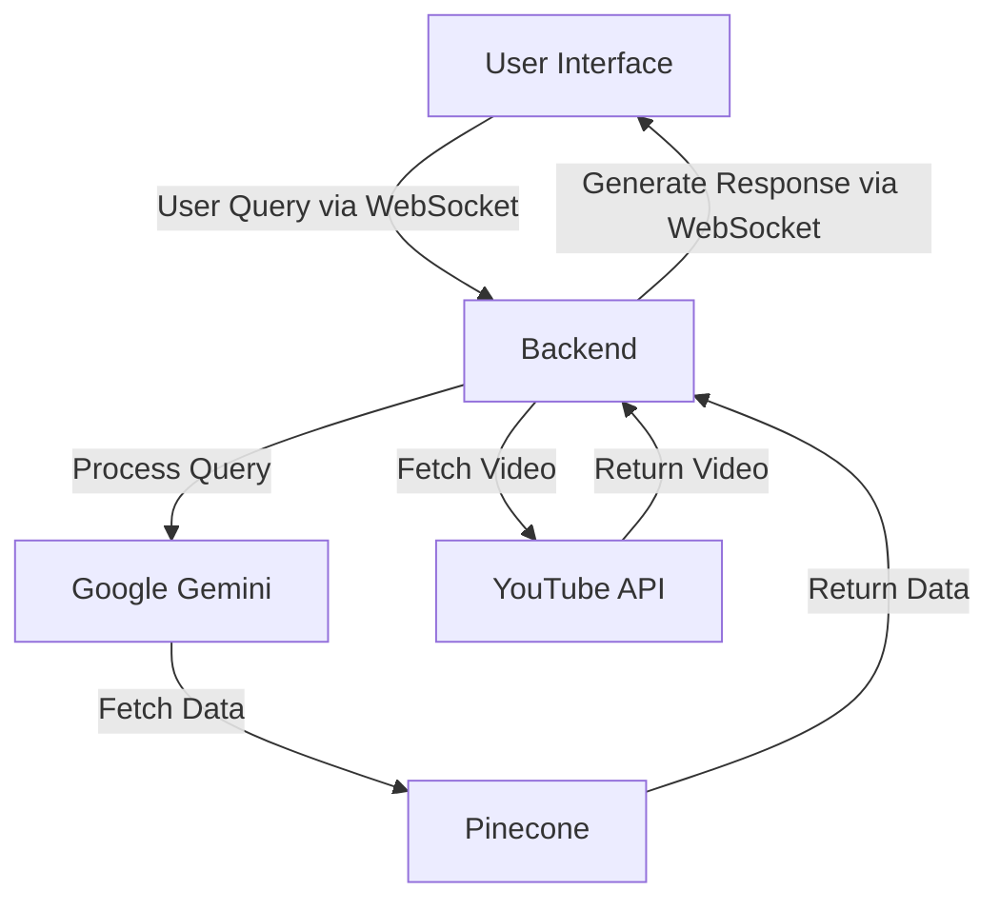
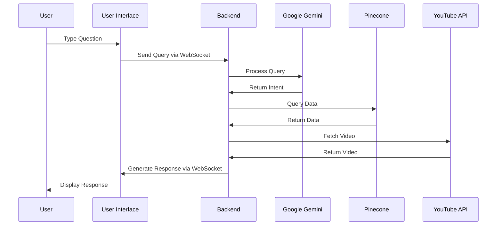

# Technical Design Document for Comfy UI Tutorial Agent

## Overview
The Comfy UI Tutorial Agent is a sidebar/chatbot interface integrated into the Comfy UI, an open-source user interface for running the Stable Diffusion model locally. The agent assists users by providing instructions, answering questions, and linking to relevant resources such as YouTube videos. The long-term goal is for the agent to create Comfy UI elements based on user requirements.

## Objectives and Goals
**Objectives**:
- Enhance user experience by providing an interactive help system within Comfy UI.
- Reduce the learning curve for new users by offering step-by-step instructions and resources.
- Increase user engagement and satisfaction by providing quick and accurate responses to user queries.

**Goals**:
- Implement a chatbot interface that can answer user questions and provide instructional content.
- Integrate the chatbot seamlessly into the Comfy UI sidebar.
- Ensure the chatbot can link to specific YouTube videos with timestamps for detailed tutorials.
- Plan for future enhancements where the chatbot can create UI elements based on user confirmation.

## Architecture and Components

The architecture of the Comfy UI Tutorial Agent consists of the following components:

1. **Frontend**: The chatbot interface will be built using React.js and integrated into the right sidebar of Comfy UI.
2. **Backend**: The server-side logic will be implemented using Python. The backend will handle user queries, process them using Google Gemini for natural language processing (NLP), and fetch relevant information from various data sources, including Pinecone (vector database).
3. **NLP Service**: Google Gemini will be used to understand user queries and generate appropriate responses.
4. **YouTube Integration**: The backend will integrate with YouTube's API to fetch video links and timestamps. Additionally, YouTube videos will be downloaded, and their transcripts (with timestamps) and screenshots will be extracted and stored in a vector database.
5. **Vector Database**: A vector database will be used to store and retrieve information extracted from YouTube videos and other data sources. This database will be queried to provide relevant information to users.
6. **Interactions Between Frontend and Backend**: The frontend and backend of the Comfy UI Tutorial Agent communicate using WebSocket. This allows for real-time, bidirectional communication between the user interface and the server. When a user types a question into the chatbot interface, the query is sent to the backend via WebSocket. The backend processes the query, retrieves the relevant information, and sends the response back to the frontend through the same WebSocket connection. This ensures that users receive quick and seamless responses to their queries.

### Components and Protocols

To implement a chatbot using WebSocket, the following components and protocols are needed:

1. **WebSocket Server**: The backend must include a WebSocket server to handle incoming connections from the frontend. This server will manage the communication between the client and the backend services.
2. **WebSocket Client**: The frontend must include a WebSocket client to establish a connection with the backend server. This client will send user queries and receive responses in real-time.
3. **Message Protocol**: Define a message protocol for communication between the client and server. This protocol should specify the format of the messages, including the query, response, and any metadata.
4. **LLM Service Integration**: Integrate the LLM service (e.g., Google Gemini) with the backend to process user queries and recognize intents.
5. **Vector Database Integration**: Integrate the vector database (e.g., Pinecone) with the backend to store and retrieve information relevant to user queries.
6. **Error Handling**: Implement robust error handling mechanisms to manage connection issues, message parsing errors, and other potential problems.



## Communication Between Client and Backend

The communication between the client (frontend) and backend is facilitated using WebSocket. This allows for real-time, bidirectional communication between the user interface and the server. The process is as follows:

1. **User Query**: The user types a question into the chatbot interface and submits it.
2. **WebSocket Communication**: The query is sent to the backend via WebSocket.
3. **LLM Service for Intent Recognition**: The backend uses a Large Language Model (LLM) service, such as Google Gemini, to process the query and recognize the user's intent.
4. **Intent Handling**:
   - If the user's intention is about the techniques of ComfyUI, the backend invokes a function to query the vector database (Pinecone) for relevant information.
   - The vector database stores and retrieves information extracted from YouTube videos and other data sources.
5. **Response Generation**: The backend generates a response based on the retrieved information and the recognized intent.
6. **WebSocket Response**: The response is sent back to the frontend via WebSocket.
7. **Display Response**: The chatbot interface displays the response to the user in the chat window.

## Data Flow
1. **User Query**: The user types a question into the chatbot interface.
2. **NLP Processing**: The query is sent to the NLP service, which processes the query and determines the intent.
3. **Data Retrieval**: Based on the intent, the backend queries the vector database and other data sources to retrieve relevant information.
4. **Response Generation**: The retrieved information is summarized, and a response is generated. The response may include a YouTube tutorial link with a timestamp.
5. **User Response**: The generated response is sent back to the chatbot interface and displayed to the user.

### WebSocket Message Format

The communication between the frontend and backend via WebSocket requires a well-defined message format. The WebSocket messages will be in JSON format to ensure easy parsing and readability. Below is the schema for the WebSocket message:

#### Schema

```json
{
  "type": "string", // Type of the message (e.g., "query", "response", "error")
  "timestamp": "string", // Timestamp of when the message was sent
  "session_id": "string", // Unique identifier for the user session
  "payload": {
    "query": "string", // The user's query (for messages of type "query")
    "response": "string", // The chatbot's response (for messages of type "response")
    "error": "string", // Error message (for messages of type "error")
    "metadata": {
      "intent": "string", // Recognized intent of the user's query
      "source": "string" // Source of the information (e.g., "vector_db", "youtube")
    }
  }
}
```

#### Example Messages

**Query Message**

```json
{
  "type": "query",
  "timestamp": "2023-10-01T12:00:00Z",
  "session_id": "abc123",
  "payload": {
    "query": "How do I install Comfy UI?"
  }
}
```

**Response Message**

```json
{
  "type": "response",
  "timestamp": "2023-10-01T12:00:02Z",
  "session_id": "abc123",
  "payload": {
    "response": "To install Comfy UI, follow these steps...",
    "metadata": {
      "intent": "installation",
      "source": "vector_db"
    }
  }
}
```

**Error Message**

```json
{
  "type": "error",
  "timestamp": "2023-10-01T12:00:01Z",
  "session_id": "abc123",
  "payload": {
    "error": "Unable to process the query. Please try again later."
  }
}
```




## Transcript Extraction with Google Gemini

Google Gemini is a multimodal model that supports text, video, and other kinds of inputs. The following prompt will be used for transcript extraction from YouTube videos:

```
Generate a transcript of the episode. Include timestamps and identify speakers.

Speakers are:
- {{ speaker }}


eg:
[00:00] Brady: Hello there.
[00:02] Tim: Hi Brady.

It is important to include the correct speaker names. Use the names you identified earlier. If you really don't know the speaker's name, identify them with a letter of the alphabet, eg there may be an unknown speaker 'A' and another unknown speaker 'B'.

If there is music or a short jingle playing, signify like so:
[01:02] [MUSIC] or [01:02] [JINGLE]

If you can identify the name of the music or jingle playing then use that instead, eg:
[01:02] [Firework by Katy Perry] or [01:02] [The Sofa Shop jingle]

If there is some other sound playing try to identify the sound, eg:
[01:02] [Bell ringing]

Each individual caption should be quite short, a few short sentences at most.

Signify the end of the episode with [END].

Don't use any markdown formatting, like bolding or italics.

Only use characters from the English alphabet, unless you genuinely believe foreign characters are correct.

It is important that you use the correct words and spell everything correctly. Use the context of the podcast to help.
If the hosts discuss something like a movie, book or celebrity, make sure the movie, book, or celebrity name is spelled correctly.
```

**Flow**:
1. **Video Input**: The YouTube video is provided as input to Google Gemini.
2. **Transcript Generation**: Google Gemini processes the video and generates a transcript using the provided prompt.
3. **Timestamp and Speaker Identification**: The transcript includes timestamps and identifies speakers as specified in the prompt.
4. **Data Storage**: The generated transcript is stored in the vector database along with the video metadata.
5. **Data Retrieval**: When a user query is processed, the relevant transcript data is retrieved from the vector database to generate a response.

## LLM Prompt for Query
The following is an example of a prompt used to query the LLM (Language Model) for generating responses:

```
User Query: {user_query}

Context: {context_information}

Generate a response that includes a summary of the relevant information and a YouTube tutorial link with a timestamp.
```

## User Interface and Experience
- The chatbot interface will be integrated into the right sidebar of Comfy UI.
- The design will include a text input field for user queries and a response area for the chatbot's answers.
- The interface will have a clean and minimalistic design to match the overall look of Comfy UI.
- Users will have a seamless experience with quick access to help and tutorials.
- The chatbot will provide clear and concise instructions, reducing the need for external searches.

## Technical Specifications
- **Frontend**: React.js for the chatbot interface.
- **Backend**: Python for the server-side logic.
- **NLP**: Google Gemini for natural language processing.
- **Integration**: YouTube API for fetching video links.
- **Vector Database**: Pinecone for storing and retrieving information extracted from YouTube videos and other data sources.

## Milestones
1. **Design Phase**: Complete UI/UX design and finalize technical specifications.
2. **Development Phase**: Implement the chatbot interface and backend services.
3. **Testing Phase**: Conduct thorough testing to ensure functionality and performance.
4. **Launch Phase**: Deploy the chatbot to the production environment.

## Risks and Mitigations
- **Technical Complexity**: The integration of NLP and YouTube API may be complex. Mitigation: Conduct thorough research and prototyping during the design phase.
- **User Adoption**: Users may be hesitant to use the new chatbot interface. Mitigation: Provide clear documentation and tutorials on how to use the chatbot.

## Acceptance Criteria
- The chatbot must be fully integrated into the Comfy UI sidebar.
- Users must be able to type questions and receive accurate responses.
- The chatbot must link to YouTube videos with specific timestamps.
- The system must handle at least 100 concurrent users without performance issues.
